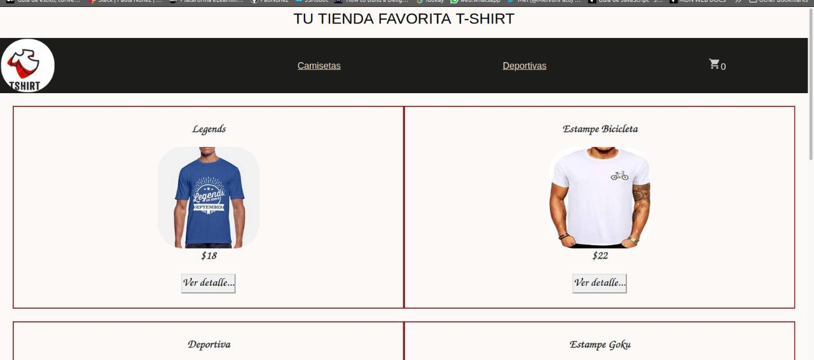
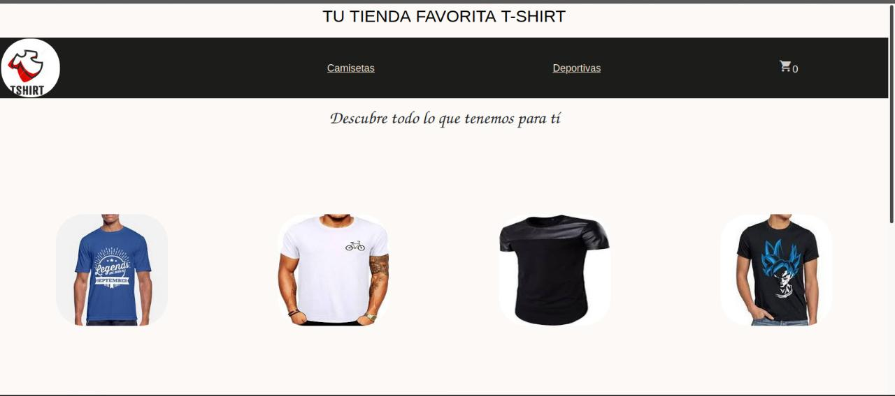

### "T-shirt" Tu tienda favorita
***
#### Descripción del proyecto:

Tu tienda favorita T-shirt es una tienda online diseñada  para poder realizar la compra de camisetas (simulación) como pagina de inicia podras observar los productos que se ingresaron en firebase (cuya principal función es desarrollar y facilitar la creación de apps de una forma rápida, con el fin de que se pueda aumentar la base de usuarios/productos. ) 

#### Aquí encontrarás un enlace al proyecto:
 [http://localhost:3000/camisetas](http://localhost:3000/camisetas/1)
 
***
#### Para navegar por la tienda:
Este proyecto tiene una interfaz amigable para que el usuario pueda moverse con facilidad y revisar los productos en venta, a su vez, podrá elegir la camiseta de su preferencia donde al dar click se mostrara el detalle de la misma y podrá realizar su compra, esta se agregara al carrito de compras y una vez finalizada la compra se le indicará su Id.

***
### Para ejecutar la aplicación debes ingresar el comando:
 `npm start`
Ejecuta la aplicación en el modo de desarrollo.\
Abre [http://localhost:3000/camisetas](http://localhost:3000/camisetas/1) para verlo en el navegador.

###  Para enviar la aplicación a producción debes ingresar el comando:
`npm run build`

Se agrupa correctamente React en el modo de producción y optimiza la compilación para obtener el mejor rendimiento.

La compilación se minimiza y los nombres de archivo incluyen los hash. \
¡Así la aplicación está lista para implementarse!

